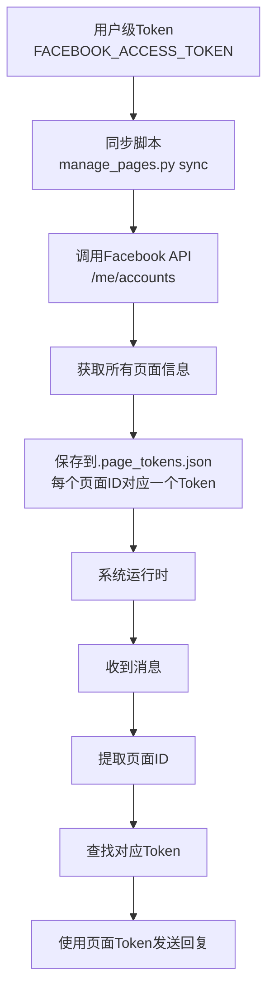

# 多页面用户级Token配置指南（10+页面）

## 概述

对于管理10多个Facebook公共主页的场景，系统完全支持使用**用户级Token**自动管理所有页面的Token。这是推荐的方式。

## 系统配置方式

### 当前系统的工作机制

系统使用**两层级Token管理**：

1. **用户级Token（环境变量）** → 存储在 `FACEBOOK_ACCESS_TOKEN` 环境变量中
   - 用于同步所有页面的Token
   - 作为默认Token（备用）

2. **页面级Token（文件存储）** → 存储在 `.page_tokens.json` 文件中
   - 每个页面有自己的Token
   - 系统自动根据页面ID选择对应的Token

### 工作流程



## 配置步骤

### 步骤1：设置用户级Token（环境变量）

在 `.env` 文件或Zeabur环境变量中设置：

```
FACEBOOK_ACCESS_TOKEN=你的用户级Token（有pages_show_list权限）
```

**重要：**
- 必须是**用户级Token**（不是页面Token）
- 必须有 `pages_show_list` 权限
- 用于获取所有可管理的页面列表

### 步骤2：同步所有页面Token

**本地环境：**
```bash
python scripts/tools/manage_pages.py sync
```

**Zeabur部署后：**
```bash
# 通过Zeabur的终端/SSH运行
python scripts/tools/manage_pages.py sync
```

**这个命令会：**
1. 使用 `FACEBOOK_ACCESS_TOKEN` 环境变量中的用户Token
2. 调用 Facebook API：`/me/accounts` 获取所有页面
3. 自动获取每个页面的Token
4. 保存到 `.page_tokens.json` 文件
5. 自动为所有页面启用自动回复

### 步骤3：验证配置

```bash
# 查看所有已配置的页面
python scripts/tools/manage_pages.py status
```

**输出示例（10+页面）：**
```
======================================================================
页面状态总览
======================================================================

📄 默认Token: ✅ 已配置

📋 已配置 12 个页面:

页面名称                           页面ID                 Token    自动回复
----------------------------------------------------------------------
页面1名称                       123456789012345      ✅        ✅ 启用
页面2名称                       234567890123456      ✅        ✅ 启用
页面3名称                       345678901234567      ✅        ✅ 启用
... (更多页面)
```

## 配置文件结构

### .page_tokens.json

同步后会自动生成此文件：

```json
{
  "tokens": {
    "default": "EAAB...用户Token（备用）",
    "123456789012345": "EAAB...页面1的Token",
    "234567890123456": "EAAB...页面2的Token",
    "345678901234567": "EAAB...页面3的Token",
    ... (所有页面的Token)
  },
  "page_info": {
    "123456789012345": {
      "name": "页面1名称",
      "updated_at": "2025-12-14"
    },
    "234567890123456": {
      "name": "页面2名称",
      "updated_at": "2025-12-14"
    },
    ... (所有页面的信息)
  }
}
```

## 系统自动选择Token的机制

### 当收到消息时

1. **提取页面ID**：从Webhook事件中提取 `page_id`
2. **查找Token**：
   ```python
   # 系统内部逻辑
   page_token = page_token_manager.get_token(page_id)
   if page_token:
       # 使用页面Token
   else:
       # 使用默认Token（用户Token）
   ```
3. **发送回复**：使用找到的Token发送消息

### 自动回复检查

系统还会检查每个页面是否启用自动回复：

```python
# 检查页面自动回复设置
if page_settings.is_auto_reply_enabled(page_id):
    # 生成并发送AI回复
```

## Zeabur部署配置

### 环境变量设置

在Zeabur控制台设置：

```
# 用户级Token（用于同步所有页面）
FACEBOOK_ACCESS_TOKEN=EAAB...你的用户级Token（有pages_show_list权限）

# 其他必需变量
FACEBOOK_APP_ID=你的App ID
FACEBOOK_APP_SECRET=你的App Secret
FACEBOOK_VERIFY_TOKEN=你的Verify Token
OPENAI_API_KEY=sk-...
TELEGRAM_BOT_TOKEN=...
TELEGRAM_CHAT_ID=...
SECRET_KEY=你的32字符密钥
DEBUG=false
CORS_ORIGINS=https://your-app-name.zeabur.app
```

### 部署后操作

1. **运行数据库迁移**
   ```bash
   alembic upgrade head
   ```

2. **同步所有页面Token**（重要！）
   ```bash
   python scripts/tools/manage_pages.py sync
   ```

3. **验证配置**
   ```bash
   python scripts/tools/manage_pages.py status
   ```

## 10+页面的最佳实践

### 1. 使用用户级Token同步（必须）

**为什么？**
- 10多个页面手动配置太麻烦
- 用户Token可以一次性获取所有页面Token
- 自动更新，无需手动维护

### 2. 定期同步Token

Token会过期（通常60天），建议：

```bash
# 每月运行一次同步，更新所有Token
python scripts/tools/manage_pages.py sync
```

### 3. 备份配置文件

```bash
# 备份Token配置
copy .page_tokens.json .page_tokens.json.backup
```

### 4. 监控Token状态

定期检查Token是否过期：

```bash
# 查看所有页面状态
python scripts/tools/manage_pages.py status
```

## 常见问题

### Q1: 用户Token需要什么权限？

**A:** 至少需要：
- `pages_show_list` - 查看页面列表（必需）
- `pages_messaging` - 发送消息（如果Token本身有权限）

### Q2: 如果用户Token没有pages_show_list权限怎么办？

**A:** 
1. 在Facebook Developer Console中申请权限
2. 或使用每个页面的Token手动配置（不推荐，太麻烦）

### Q3: 同步后，.page_tokens.json文件在哪里？

**A:** 
- 本地：项目根目录 `.page_tokens.json`
- Zeabur：容器内的项目根目录

### Q4: 如何更新某个页面的Token？

**A:** 
```bash
# 方法1：重新同步所有页面（推荐）
python scripts/tools/manage_pages.py sync

# 方法2：手动更新单个页面
python scripts/tools/manage_pages.py add <page_id> <new_token> "页面名称"
```

### Q5: 新增了页面怎么办？

**A:** 
运行同步命令，会自动检测并添加新页面：
```bash
python scripts/tools/manage_pages.py sync
```

### Q6: 如何为特定页面禁用自动回复？

**A:** 
```bash
python scripts/tools/manage_pages.py disable <page_id>
```

或编辑 `config/config.yaml`：
```yaml
page_settings:
  "123456789012345":
    auto_reply_enabled: false
```

## 系统配置总结

### 当前配置方式

✅ **已支持用户级Token**
- 通过 `sync_from_user_token()` 方法
- 使用 `manage_pages.py sync` 命令
- 自动获取所有页面Token

✅ **自动Token选择**
- 根据页面ID自动选择Token
- 无需手动配置每个页面

✅ **自动回复管理**
- 可以为每个页面单独配置
- 支持批量启用/禁用

### 配置流程

```
1. 设置 FACEBOOK_ACCESS_TOKEN=用户级Token
   ↓
2. 运行 python scripts/tools/manage_pages.py sync
   ↓
3. 系统自动获取所有页面Token
   ↓
4. 保存到 .page_tokens.json
   ↓
5. 系统运行时自动使用对应Token
```

## 相关文档

- [多页面Token管理指南](../guides/MULTI_PAGE_TOKEN_MANAGEMENT.md)
- [Zeabur多页面配置](ZEABUR_MULTI_PAGE_SETUP.md)
- [页面自动回复配置](../guides/PAGE_AUTO_REPLY_GUIDE.md)

