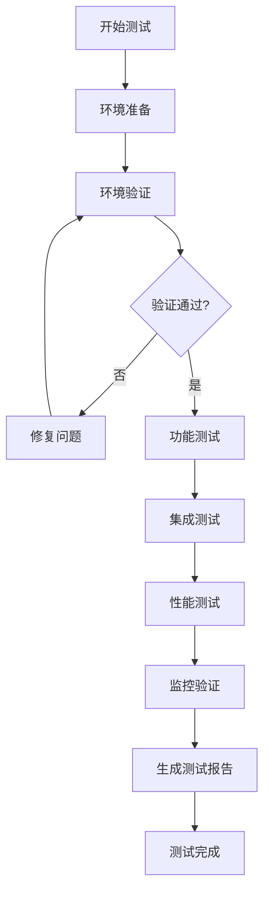

# 生产环境测试流程

## 概述

本文档详细描述了在生产环境中进行系统测试的完整流程，包括测试前准备、环境验证、功能测试、集成测试、性能测试和监控验证等步骤。

## 测试流程概览



## 一、测试前准备

### 1.1 环境配置检查

**检查项：**
- [ ] `.env` 文件已创建并配置所有必需的环境变量
- [ ] `config/config.yaml` 文件已创建并配置业务规则
- [ ] 所有API密钥已配置且有效
- [ ] 数据库连接字符串已配置

**验证命令：**
```bash
# 检查环境变量
python -c "from src.core.config import settings; print('配置加载成功')"

# 检查配置文件
python -c "from src.core.config import yaml_config; print('YAML配置加载成功')"
```

### 1.2 数据库迁移验证

**检查项：**
- [ ] 数据库已创建
- [ ] 数据库用户已创建并授权
- [ ] 数据库连接测试通过
- [ ] 所有迁移文件已执行

**验证命令：**
```bash
# 检查当前迁移版本
alembic current

# 查看迁移历史
alembic history

# 执行迁移（如果未执行）
alembic upgrade head

# 验证表创建
python -c "
from src.core.database.connection import engine
from sqlalchemy import inspect
inspector = inspect(engine)
tables = inspector.get_table_names()
required_tables = ['conversations', 'customers', 'statistics']
for table in required_tables:
    if table in tables:
        print(f'✅ {table} 表存在')
    else:
        print(f'❌ {table} 表不存在')
"
```

### 1.3 API密钥验证

**检查项：**
- [ ] Facebook API密钥有效
- [ ] OpenAI API密钥有效
- [ ] Telegram Bot令牌有效
- [ ] 所有API密钥权限正确

**验证命令：**
```bash
# 运行API密钥验证脚本
python scripts/tools/verify_api_keys.py
```

### 1.4 依赖安装验证

**检查项：**
- [ ] 虚拟环境已创建
- [ ] 所有依赖已安装
- [ ] 无依赖冲突

**验证命令：**
```bash
# 检查依赖安装
pip list | grep -E "(fastapi|sqlalchemy|openai|httpx)"

# 验证关键依赖
python -c "import fastapi; import sqlalchemy; import openai; print('✅ 关键依赖已安装')"
```

## 二、环境验证测试

### 2.1 服务启动测试

**测试步骤：**
1. 启动服务
2. 检查启动日志
3. 验证服务运行状态

**测试命令：**
```bash
# 启动服务
python run.py
# 或
uvicorn src.main:app --host 0.0.0.0 --port 8000

# 检查启动日志
# 应该看到：
# - "Starting Multi-Platform Customer Service Automation System..."
# - "Database tables created/verified"
# - "Auto-reply scheduler started"
# - "Summary notification scheduler started"
# - 无错误信息
```

**预期结果：**
- ✅ 服务正常启动
- ✅ 无启动错误
- ✅ 所有调度器已启动

### 2.2 健康检查测试

**测试步骤：**
1. 访问健康检查端点
2. 验证返回状态
3. 检查各项健康指标

**测试命令：**
```bash
# 健康检查
curl http://localhost:8000/health

# 或使用PowerShell
Invoke-WebRequest -Uri "http://localhost:8000/health" | Select-Object -ExpandProperty Content
```

**预期结果：**
- ✅ 返回状态码 200
- ✅ 返回JSON格式数据
- ✅ 所有健康检查项通过

### 2.3 数据库连接测试

**测试步骤：**
1. 测试数据库连接
2. 执行简单查询
3. 验证连接池配置

**测试命令：**
```bash
python -c "
from src.core.database.connection import engine, get_db
from sqlalchemy import text

# 测试连接
with engine.connect() as conn:
    result = conn.execute(text('SELECT 1'))
    print('✅ 数据库连接成功')

# 测试会话
db = next(get_db())
print('✅ 数据库会话创建成功')
"
```

**预期结果：**
- ✅ 数据库连接成功
- ✅ 查询执行正常
- ✅ 连接池配置正确

### 2.4 配置加载测试

**测试步骤：**
1. 验证环境变量加载
2. 验证YAML配置加载
3. 检查配置完整性

**测试命令：**
```bash
python -c "
from src.core.config import settings, yaml_config

# 检查环境变量
print(f'数据库URL: {settings.database_url[:20]}...')
print(f'Facebook App ID: {settings.facebook_app_id[:10]}...')
print(f'OpenAI Model: {settings.openai_model}')

# 检查YAML配置
config = yaml_config.get('telegram', {})
print(f'Telegram配置: {bool(config)}')
"
```

**预期结果：**
- ✅ 所有配置加载成功
- ✅ 配置值正确
- ✅ 无配置缺失

## 三、功能测试

### 3.1 Webhook接收测试

#### Facebook Webhook测试

**测试步骤：**
1. 配置Facebook Webhook URL
2. 发送测试消息到Facebook页面
3. 验证Webhook接收
4. 检查数据库记录

**测试方法：**
```bash
# 1. 验证Webhook配置
curl "http://localhost:8000/webhook?hub.mode=subscribe&hub.verify_token=YOUR_VERIFY_TOKEN&hub.challenge=test"

# 2. 发送测试消息（通过Facebook页面）
# 在Facebook页面上发送一条测试消息

# 3. 检查日志
tail -f logs/app.log | grep "webhook"

# 4. 检查数据库
python -c "
from src.core.database.connection import get_db
from src.core.database.models import Conversation
db = next(get_db())
recent = db.query(Conversation).order_by(Conversation.created_at.desc()).first()
if recent:
    print(f'✅ 最新消息: {recent.content[:50]}...')
else:
    print('❌ 未找到消息记录')
"
```

**预期结果：**
- ✅ Webhook验证成功
- ✅ 消息接收成功
- ✅ 数据库记录创建
- ✅ 日志记录正确

#### Instagram Webhook测试（如果启用）

**测试步骤：**
类似Facebook Webhook测试，使用Instagram端点。

### 3.2 AI自动回复测试

**测试步骤：**
1. 发送包含产品关键词的消息
2. 等待AI回复
3. 验证回复内容
4. 检查回复记录

**测试方法：**
```bash
# 1. 发送测试消息（通过Facebook页面）
# 消息内容应包含产品关键词，如："我想了解iPhone贷款"

# 2. 等待回复（通常几秒内）

# 3. 检查回复记录
python -c "
from src.core.database.connection import get_db
from src.core.database.models import Conversation
db = next(get_db())
recent = db.query(Conversation).filter(
    Conversation.ai_replied == True
).order_by(Conversation.updated_at.desc()).first()
if recent:
    print(f'✅ AI已回复: {recent.ai_reply[:50]}...')
else:
    print('❌ 未找到AI回复记录')
"
```

**预期结果：**
- ✅ AI回复生成成功
- ✅ 回复内容符合业务规则
- ✅ 回复已发送到用户
- ✅ 数据库记录更新

### 3.3 自动扫描调度器测试

**测试步骤：**
1. 创建未回复的消息（或等待5分钟）
2. 检查调度器是否运行
3. 验证未回复消息是否被处理
4. 检查日志

**测试方法：**
```bash
# 1. 检查调度器状态（查看日志）
tail -f logs/app.log | grep "auto-reply"

# 2. 等待5分钟（调度器每5分钟运行一次）

# 3. 检查处理结果
python -c "
from src.core.database.connection import get_db
from src.core.database.models import Conversation
from datetime import datetime, timedelta
db = next(get_db())
five_min_ago = datetime.now() - timedelta(minutes=5)
recent_replies = db.query(Conversation).filter(
    Conversation.ai_replied == True,
    Conversation.updated_at >= five_min_ago
).count()
print(f'✅ 过去5分钟处理了 {recent_replies} 条消息')
"
```

**预期结果：**
- ✅ 调度器正常运行
- ✅ 未回复消息被检测到
- ✅ 消息被自动回复
- ✅ 日志记录正确

### 3.4 Telegram通知测试

**测试步骤：**
1. 触发通知事件（如新消息、错误等）
2. 验证Telegram消息发送
3. 检查通知内容

**测试方法：**
```bash
# 1. 手动触发通知（通过API或代码）
python -c "
from src.telegram.notification_sender import NotificationSender
import asyncio

async def test():
    sender = NotificationSender()
    await sender.send_notification('测试通知', '这是一条测试消息')
    await sender.close()

asyncio.run(test())
"

# 2. 检查Telegram群组是否收到消息
```

**预期结果：**
- ✅ 通知发送成功
- ✅ 通知内容正确
- ✅ 无发送错误

### 3.5 统计功能测试

**测试步骤：**
1. 访问统计API端点
2. 验证统计数据
3. 检查数据准确性

**测试方法：**
```bash
# 1. 获取每日统计
curl http://localhost:8000/statistics/daily

# 2. 获取自定义时间范围统计
curl "http://localhost:8000/statistics?start_date=2025-01-01&end_date=2025-01-31"

# 3. 验证数据
python -c "
import requests
response = requests.get('http://localhost:8000/statistics/daily')
data = response.json()
print(f'✅ 今日消息数: {data.get(\"total_messages\", 0)}')
print(f'✅ AI回复数: {data.get(\"ai_replies\", 0)}')
"
```

**预期结果：**
- ✅ 统计API正常响应
- ✅ 统计数据准确
- ✅ 数据格式正确

## 四、集成测试

### 4.1 端到端消息流程测试

**测试场景：**
完整的消息处理流程，从接收消息到发送回复。

**测试步骤：**
1. 发送消息到Facebook页面
2. 验证消息接收和处理
3. 验证AI回复生成
4. 验证回复发送
5. 验证数据库记录
6. 验证Telegram通知（如果配置）

**测试方法：**
```bash
# 使用自动化测试脚本
python scripts/test/production_test.py --test e2e_workflow
```

**预期结果：**
- ✅ 所有步骤执行成功
- ✅ 数据一致性正确
- ✅ 无错误发生

### 4.2 多页面处理测试

**测试步骤：**
1. 配置多个Facebook页面
2. 向不同页面发送消息
3. 验证每个页面都能正常处理
4. 检查页面隔离

**测试方法：**
```bash
# 检查页面配置
python -c "
from src.config.page_token_manager import page_token_manager
pages = page_token_manager.list_pages()
print(f'✅ 已配置 {len(pages)} 个页面')
for page_id, info in pages.items():
    print(f'  - 页面 {page_id}: {info.get(\"name\", \"未知\")}')
"
```

**预期结果：**
- ✅ 所有页面配置正确
- ✅ 每个页面独立处理
- ✅ 无页面间干扰

### 4.3 错误处理测试

**测试场景：**
- API调用失败
- 数据库连接失败
- 无效消息格式
- 网络超时

**测试方法：**
```bash
# 测试错误处理
python -c "
# 模拟各种错误场景
# 1. 无效的Webhook请求
# 2. 数据库连接失败
# 3. API调用失败
# 验证系统是否优雅处理错误
"
```

**预期结果：**
- ✅ 错误被正确捕获
- ✅ 错误日志记录
- ✅ 系统继续运行
- ✅ 用户收到适当反馈

### 4.4 速率限制测试

**测试步骤：**
1. 快速发送多条消息
2. 验证速率限制是否生效
3. 检查API调用频率

**测试方法：**
```bash
# 检查速率限制配置
python -c "
from src.facebook.api_client import FacebookAPIClient
# 查看API客户端的延迟配置
"
```

**预期结果：**
- ✅ 速率限制生效
- ✅ 无API限流错误
- ✅ 消息处理正常

## 五、性能测试

### 5.1 响应时间测试

**测试指标：**
- API端点响应时间
- 数据库查询时间
- AI回复生成时间

**测试方法：**
```bash
# 使用性能测试脚本
python scripts/test/production_test.py --test performance

# 或手动测试
time curl http://localhost:8000/health
```

**预期结果：**
- ✅ 健康检查 < 100ms
- ✅ API响应 < 500ms
- ✅ AI回复生成 < 5s

### 5.2 并发处理测试

**测试步骤：**
1. 同时发送多条消息
2. 验证并发处理能力
3. 检查资源使用

**测试方法：**
```bash
# 并发测试脚本
python scripts/test/production_test.py --test concurrency
```

**预期结果：**
- ✅ 支持至少10个并发请求
- ✅ 无资源竞争
- ✅ 消息处理正确

### 5.3 数据库查询性能测试

**测试步骤：**
1. 执行常见查询
2. 检查查询时间
3. 验证索引使用

**测试方法：**
```bash
python -c "
from src.core.database.connection import get_db
from src.core.database.models import Conversation
import time

db = next(get_db())
start = time.time()
result = db.query(Conversation).limit(100).all()
elapsed = time.time() - start
print(f'✅ 查询100条记录耗时: {elapsed:.3f}秒')
"
```

**预期结果：**
- ✅ 查询时间 < 1s（100条记录）
- ✅ 索引使用正确
- ✅ 无慢查询

### 5.4 内存和CPU使用测试

**测试步骤：**
1. 监控系统资源使用
2. 执行压力测试
3. 检查资源泄漏

**测试方法：**
```bash
# 使用系统监控工具
# Windows: Task Manager 或 PowerShell
Get-Process python | Select-Object CPU, WorkingSet

# Linux: top 或 htop
top -p $(pgrep -f "python.*main")
```

**预期结果：**
- ✅ 内存使用稳定
- ✅ CPU使用正常
- ✅ 无资源泄漏

## 六、监控验证

### 6.1 日志输出验证

**检查项：**
- [ ] 日志文件正常创建
- [ ] 日志级别正确
- [ ] 日志格式正确
- [ ] 日志轮转正常

**验证方法：**
```bash
# 检查日志文件
ls -lh logs/app.log

# 查看最新日志
tail -n 50 logs/app.log

# 检查日志级别
grep -i "level" logs/app.log | head -5
```

**预期结果：**
- ✅ 日志文件存在
- ✅ 日志内容完整
- ✅ 日志级别正确
- ✅ 日志轮转正常

### 6.2 监控指标验证

**检查项：**
- [ ] 健康检查端点正常
- [ ] 性能指标端点正常
- [ ] 统计数据准确

**验证方法：**
```bash
# 检查监控端点
curl http://localhost:8000/health
curl http://localhost:8000/metrics
curl http://localhost:8000/statistics/daily
```

**预期结果：**
- ✅ 所有监控端点正常
- ✅ 指标数据准确
- ✅ 数据格式正确

### 6.3 告警机制验证

**检查项：**
- [ ] 错误告警配置
- [ ] 告警触发正常
- [ ] 告警通知正常

**验证方法：**
```bash
# 检查告警配置（如果实现）
# 触发测试错误，验证告警是否发送
```

**预期结果：**
- ✅ 告警配置正确
- ✅ 告警触发及时
- ✅ 通知发送成功

## 七、测试报告

### 7.1 生成测试报告

**方法：**
```bash
# 使用自动化测试脚本生成报告
python scripts/test/production_test.py --report

# 报告将保存在 data/test_reports/ 目录
```

### 7.2 测试结果记录

**记录内容：**
- 测试日期和时间
- 测试环境信息
- 测试结果摘要
- 发现的问题
- 性能指标
- 建议和改进

### 7.3 问题跟踪

**问题记录模板：**
- 问题描述
- 严重程度（高/中/低）
- 复现步骤
- 预期行为
- 实际行为
- 修复建议

## 八、测试完成标准

### 必须通过的测试（阻塞性问题）

- [ ] 服务可以正常启动
- [ ] 数据库连接正常
- [ ] 健康检查通过
- [ ] Webhook接收正常
- [ ] AI自动回复功能正常
- [ ] 数据库记录正确
- [ ] 无严重错误日志

### 建议通过的测试（非阻塞性）

- [ ] 性能指标正常
- [ ] 监控功能正常
- [ ] 统计功能正常
- [ ] Telegram通知正常
- [ ] 多页面处理正常

## 九、常见问题排查

### 问题1：服务启动失败

**排查步骤：**
1. 检查环境变量配置
2. 检查数据库连接
3. 查看启动日志
4. 验证依赖安装

### 问题2：Webhook接收失败

**排查步骤：**
1. 检查Webhook URL配置
2. 验证verify_token
3. 检查防火墙设置
4. 查看Webhook日志

### 问题3：AI回复失败

**排查步骤：**
1. 检查OpenAI API密钥
2. 验证API调用日志
3. 检查消息内容
4. 查看错误日志

### 问题4：数据库连接失败

**排查步骤：**
1. 检查数据库URL
2. 验证数据库服务运行
3. 检查用户权限
4. 查看连接日志

## 十、后续维护

### 定期测试

建议定期执行以下测试：
- 每日：健康检查
- 每周：功能测试
- 每月：完整测试流程
- 每季度：性能测试

### 监控和告警

- 设置监控告警
- 定期检查日志
- 监控性能指标
- 跟踪错误率

## 附录

### 测试工具

- `scripts/test/production_test.py` - 自动化测试脚本
- `scripts/test/quick_production_test.bat` - Windows快速测试
- `scripts/test/quick_production_test.sh` - Linux/Mac快速测试

### 相关文档

- [部署检查清单](../deployment/DEPLOYMENT_CHECKLIST.md)
- [部署指南](../deployment/DEPLOYMENT_GUIDE.md)
- [故障排查指南](../troubleshooting/)

### 联系支持

如遇到问题，请：
1. 查看日志文件：`logs/app.log`
2. 参考故障排查文档
3. 联系技术支持团队

